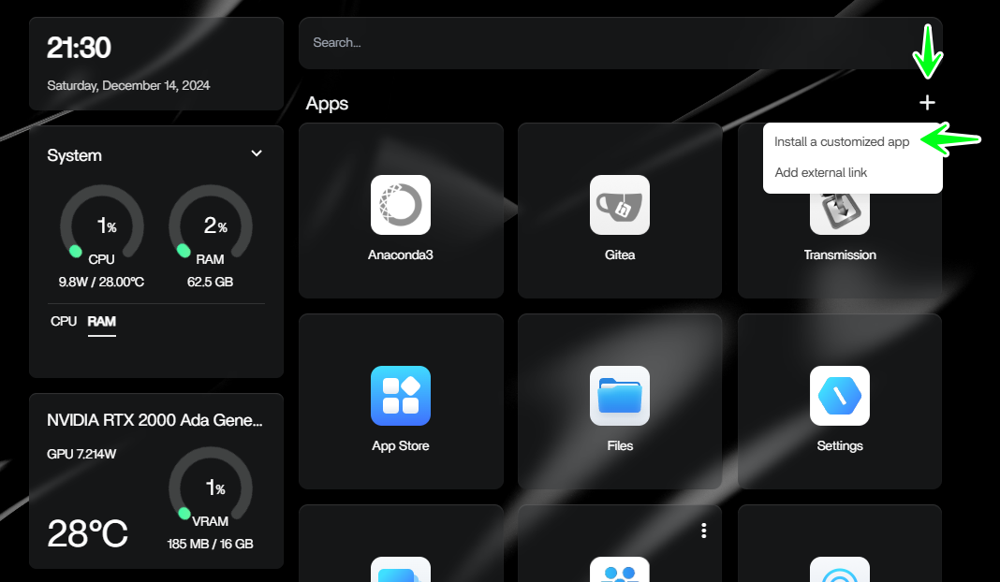
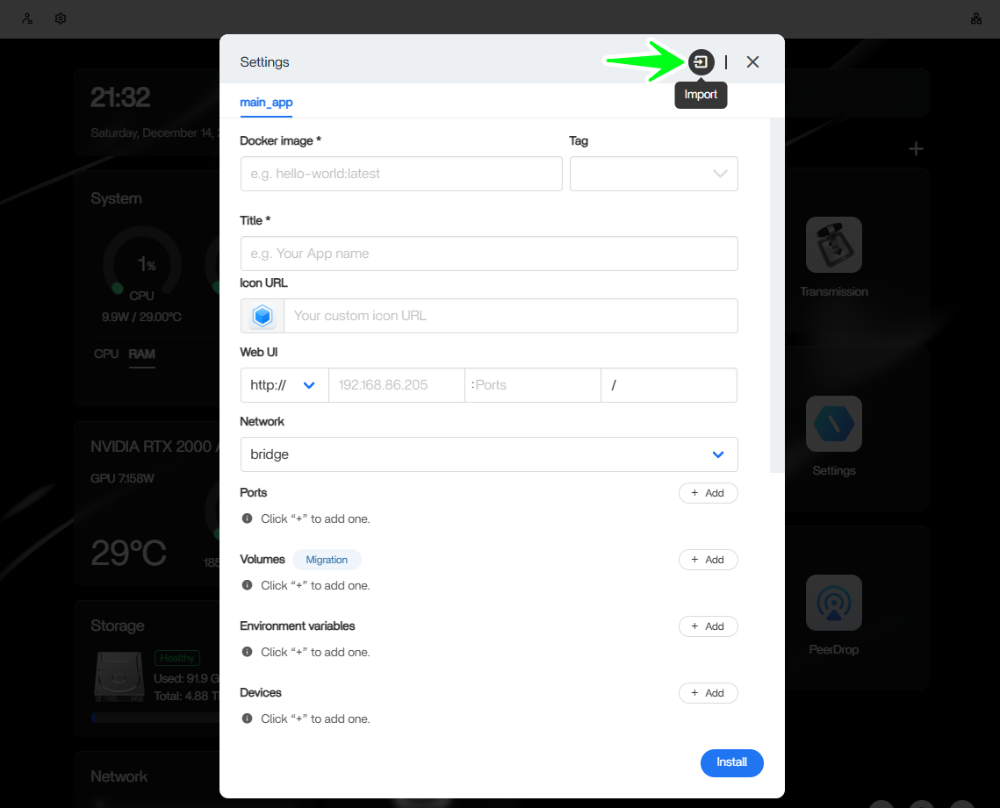
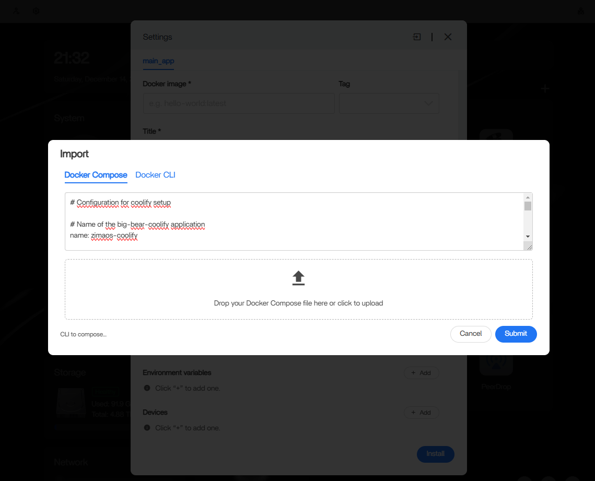

# Coolify for ZimaOS*

## This is a learning repository, CasaOS and ZimaOS share the same App store, the efforts to make Coolify work as a one-click application

Coolify is an all-in one PaaS that helps you to self-host your own applications, databases or services (like Wordpress, Plausible Analytics, Ghost) without managing your servers and all the complexity that comes with it, it is also known as an open-source & self-hostable Heroku / Netlify / Vercel alternative.

## Installing Coolify on your self-hosted ZimaOS server

1. Clone or copy the `docker-compose.yml` content of the `app` folder from the repo.
2. Enter your ZimaOS dashboard and click on the plus button on the top right and then click on `Install a customized app`.wtf 

3. Click on the `Import` button.

4. Paste the `docker-compose.yml` content into the input field and press the `Submit` button.

5. Click on `Install` in the open window.

## Known issue's
- Title and icon are not updating properly.
It seems to prefix or default your app title and icon url with `https://cdn.jsdelivr.net/gh/IceWhaleTech/CasaOS-AppStore@main/Apps/` which is not valid.

## Special Thanks

I would like to thank the team of Zima & IceWhale along with creators and contributors like HeyAndras and Dragonfire for all the work & guidance they provided during this learning journey.

Visit [Zima](https://www.zimaspace.com/) to learn more about their amazing products. 
Visit [Coolify](https://coolify.io/) to learn more about self host PaaS.
Visit [Awesome CasaOS](https://awesome.casaos.io/content/3rd-party-app-stores/list.html) and this [repo](https://github.com/IceWhaleTech/CasaOS-AppStore) to learn how to create your own CasaOS App Store. 

Visit the [Big Bear Community](https://community.bigbeartechworld.com/) and [repository](https://github.com/bigbeartechworld) to accelerate learning and building for CasaOS with dragonfire's vast collection.
